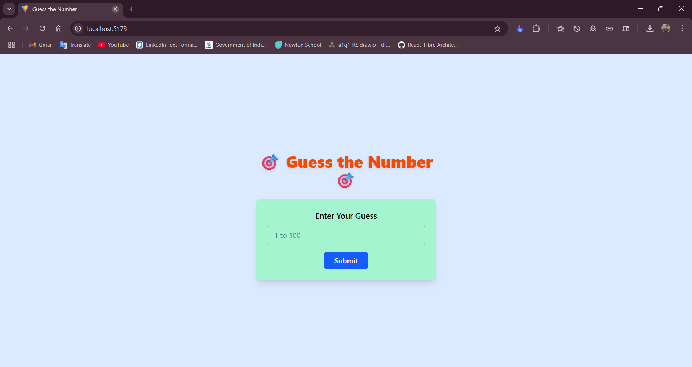

# 🎯 Guess the Number - Web Game

A minimalist, interactive **number guessing game** built using **HTML**, **Vanilla JavaScript**, and **Tailwind CSS**. The user must guess a randomly generated number between 1 and 100 within a limited number of attempts. This project demonstrates core frontend concepts such as event handling, DOM manipulation, and form validation, alongside utility-first styling with Tailwind CSS.

---

## 📸 Preview



---

## 🚀 Features

- 🎲 Random number generation (1 to 100)
- 🧠 Tracks and displays user guesses
- 🧮 Limited number of attempts (default: 10)
- ✅ Success message for correct guess
- ❌ Failure message when all attempts are exhausted
- 🌈 Styled with Tailwind CSS for a clean UI
- ⚡ Smooth user interaction with `JavaScript Event Listeners`
- 🔒 Disables input after win or loss

---

## 📁 Project Structure

```bash
js_guess_the_number/
├── .gitignore
├── index.html              # Main HTML page
├── LICENSE
├── package.json
├── package-lock.json
├── public/
│   └── vite.svg            # Public assets (if any)
├── node_modules/           # Installed packages
├── README.md               # Project documentation
├── src/
│   ├── main.js             # Game logic
│   └── style.css           # Tailwind CSS styles
└── vite.config.js          # Vite configuration
```

---

## 🧑‍💻 Technologies Used

- **HTML5** - Semantic structure
- **CSS3 (Tailwind CSS)** - Responsive styling
- **JavaScript (ES6+)** - Game logic and DOM manipulation
- **[Optional] Vite** - For module bundling and fast refresh

---

## 📝 How to Play

1. Enter a number between **1 and 100** in the input box.
2. Click the **Submit** button to make a guess.
3. The result section will tell you whether the guess was:
   - **Too small**
   - **Too large**
   - **Correct**
4. You get **10 attempts** by default.
5. After a successful guess or when attempts run out:
   - Inputs and buttons are disabled.
   - A final message is displayed.

---

## ⚙️ How to Run Locally

1. **Clone this repository:**

   ```bash
   git clone https://github.com/itspriyambhattacharya/js_guess_the_number.git
   cd js_guess_the_number
   ```

2. **Install dependencies (if using Vite and Tailwind CLI):**

   ```bash
   npm install
   npm run dev
   ```

   Or, just open `index.html` directly in the browser if not using a bundler.

3. **Play the game** 🎮

---

## 🧠 Code Overview

### index.html

- Contains a single-page layout with:
  - A title header
  - A form to input guesses
  - A hidden result display area
- Fully styled using **Tailwind CSS** utility classes

### main.js

- Generates a random number between 1–100
- Handles:
  - Button click events
  - Input validation
  - Dynamic message creation in DOM
- Tracks attempts and disables inputs after success or failure

#### Key Logic Snippet

```js
const rand = Math.floor(Math.random() * 100 + 1);
if (val === rand) {
  // Success
} else if (val > rand) {
  // Too large
} else {
  // Too small
}
```

---

## 🧪 Future Enhancements

- Add a **Restart Game** button
- Show **guess history** with timestamps
- Support **keyboard enter key** as trigger
- Responsive enhancements for mobile screens
- Option to change the **number of attempts**

---

## 📄 License

This project is open-source and available under the [MIT License](LICENSE).

---

## 🙌 Acknowledgements

- Tailwind CSS – for rapid UI design
- JavaScript DOM API – for enabling interactive frontend behavior
